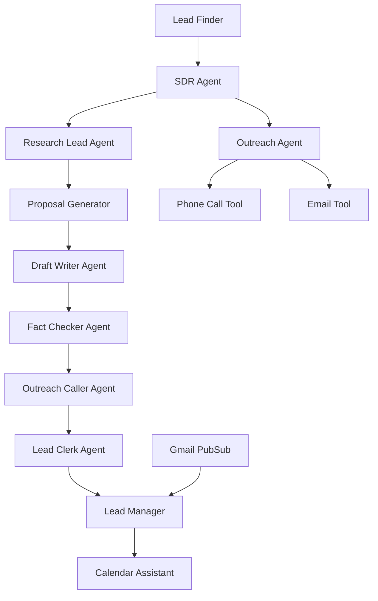

# 🚀 SalesShortcut - AI-Powered SDR Agent System

A comprehensive AI-powered Sales Development Representative (SDR) system built with multi-agent architecture for automated lead generation, research, proposal generation, and outreach.

## 🎯 Project Overview

SalesShortcut is a sales automation and engagement platform that **finds, creates, and converts leads** through intelligent AI agents. The system automatically discovers potential business leads, researches their needs, creates personalized proposals, and manages outreach campaigns including phone calls and email communication.

## 🏗️ Architecture

SalesShortcut consists of 5 specialized microservices working together:

### Core Services

- **🔍 [Lead Finder](./lead_finder/README.md)** - Discovers potential business leads in specified cities using Google Maps and location-based search
- **🧠 [SDR Agent](./sdr/README.md)** - Main orchestrator conducting research, proposal generation, and outreach (includes phone calls and email)
- **📋 [Lead Manager](./lead_manager/README.md)** - Manages lead data, tracks conversion status, and handles meeting scheduling
- **🖥️ [UI Client](./ui_client/README.md)** - Web dashboard for monitoring and controlling the entire system
- **📧 [Gmail PubSub Service](./gmail_pubsub_listener/README.md)** - Handles incoming email responses and lead engagement tracking

### Agent Workflow

